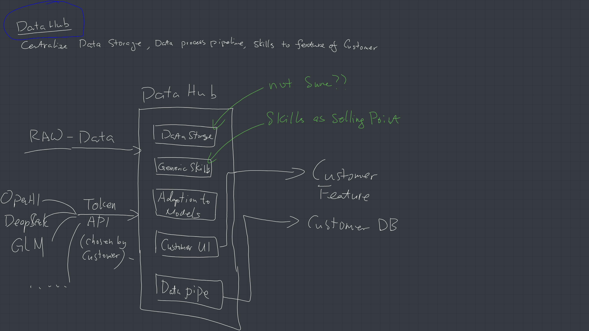

# Datara brainstorming record

Session date: 30 September 2026. Founder: Feng Guo. Discussion partner: Codex.

This is a structured record of the brainstorming session, including founder statements, decisions, alternatives, and open questions. It is not a verbatim chat transcript. Quotes below preserve the founder's wording. The current delivery baseline is the [project brief and roadmap](project-brief-and-roadmap.md); this record explains how we arrived there.

## Original concept

The original drawing is preserved unchanged. It names the concept **Data Hub** and describes centralized data storage, a data processing pipeline, and skills serving customer features. Raw data enters the hub. Customers choose model access through tokens or APIs, with OpenAI, DeepSeek, and GLM shown as examples. The hub contains data storage, generic skills, model adaptation, a customer UI, and a data pipeline. Outputs go to customer features and a customer database.

The annotations identify **skills as the selling point**, while storage is initially marked uncertain. Later discussion resolves storage as a persistent data home and separates model-independent expertise from provider-specific interfaces.

## 1 Product ambition and first example

The founder asked for a business-partner brainstorming session. The initial interpretation was a hub that turns customer data into business outputs through reusable skills, with customer-selected models. Engineering data was suggested as a possible starting area, but was not selected.

> It could be a broad spectrum of usage. Take one example, athletes, they can upload their raw training and fitness data onto data hub. Data hub offer different choices of expertise from training, doctors, health experts. And the athlete can enjoin the outcome of all experts diagnosing and advising

**Direction:** the platform remains broad; athletes provide the first concrete use case. Different expertise can work on a common history. Training, recovery, nutrition, and medical expertise were illustrative categories, not approved P0 skills or validated clinical capabilities.

The discussion raised coordinated outcomes, conflicting advice, missing context, and the need to distinguish observations from assessments. Resolving disagreements between skills remains a design task.

## 2 Expertise is packaged by real experts

> By experts I mean the skills on data hub market place to get which provided from real expert person.

**Decision:** expert-created skills can execute without the expert personally reviewing every case. They should encode methods, required inputs, tools, criteria, exceptions, and output requirements rather than merely an expert persona.

Creator identity, evaluation of the skill, and human review of an individual output are separate concepts. Model choice may affect results. These are quality-design considerations for the later creator platform.

## 3 Creators are users too

> For skill creation, I would like to design the use case in the way that creator do not have to touch the model and the adaptation to different models parts. Data hub offers it as feature for creators. The background is, a lots of offline experts, they do not have ai experience and basic knowledge of operating this technology. Eventually we should treat them as our user.

**Decision:** Datara owns model adaptation and execution technology. Creators should teach their expertise through familiar materials and review, without learning AI interfaces.

**Suggested future journey:** describe a service, supply materials or an interview, explain judgment, correct trial cases, approve publication, and maintain versions. Whether onboarding starts with uploads, a guided conversation, or an interview was not decided.

## 4 Existing materials as a starting point

> You just brought a whole new perspective, why we cannot directly use existing materials like interviews with experts and some foundation books. And abstract from those then information what we need.

**Direction:** materials can seed knowledge and skills. Concepts become interpretive knowledge; methods become workflow steps; examples become evaluation cases; exceptions become boundaries; missing information becomes questions. Source passages or video timestamps should support traceability.

The discussion distinguished foundational knowledge from an expert's distinctive judgment. Use of third-party materials requires separate source-rights decisions; the free-skill planning assumption does not resolve those rights.

## 5 Trial phase and model independence

> I would like to helping experts to commercialize their own IP and skills. But I do not believe data hub can do that at trail phase. What helps now would be to take books and YouTube videos as our input, create firstly a baseline for different elemental skills. Again, the skills shall not be dependent of model interfaces and interaction, so basically skills shall work with all different models at the end, only the performance and effectiveness would be different. But that is the call of customer which model they want to use

**Decisions:** expert IP commercialization is a future goal. Initially Datara creates baseline skills, with books and videos as candidate sources. Skills stay independent of provider interfaces; customers choose their models and accept differences in performance.

**Implementation boundary:** model portability is the objective. Supported connection interfaces must still be defined, and failed or inadequate execution must be reported. Equal capability across models is not assumed.

## 6 Elemental skills are building blocks

> I mean the building blocks

**Decision:** elemental skills are small reusable units, rather than complete fixed services. Illustrative candidates included training consistency, load-change interpretation, recovery trends, missing-information checks, and translating assessments into suggested actions. None is yet selected as the baseline release set.

Conventional data tools, elemental expertise, and complete user outcomes are distinct layers. Skill specifications should include inputs, methods, boundaries, outputs, and evaluation cases. Interoperable outputs and conflict handling need design.

## 7 Users choose combinations

> I am not sure about it. I do not want individual creators able to decide which combination of skills user shall use for their demands. What we can do is to make each skills some key strengths and possible connection of which partner skills. Then use ai to suggest user based on their demands and give them the options which combination can use.

**Decision:** creators describe strengths and possible partners; AI proposes combinations; users choose. Creator partner lists are advisory. True input dependencies must be distinguished from commercial or interpretive partner recommendations.

Recommendations should explain contributions, prerequisites, overlap, and limitations. Input and output compatibility needs checking beyond a creator's suggested partner list.

## 8 Marketplace search with owned skills first

> From marketplace, but preference would be to use their owns first

**Decision:** recommendations search the full marketplace and prioritize owned skills when suitable. Ownership cannot override input eligibility or capability. Owned-only, gap-filling, and alternative combinations were suggested presentation options, not fixed UI requirements.

Skill ownership, execution cost, licensing, and updates were raised but commercial design was subsequently deferred.

## 9 Free skills and a background creation system

> For the commercial part, lets firstly skip this. And assume all the skills are free and license free. Creation of skills firstly only from data hub. We would need a underground system which abstract from mentioned materials into knowledge skills and keep it updated to data hub

**Decisions:** assume free, license-free skills for planning; Datara is initially the only creator. A background source-to-skill system should later extract knowledge, build elemental skills, and maintain them.

**Suggested process:** collect sources, extract knowledge, reconcile differences, build skills, evaluate, publish, and maintain. Keep source knowledge distinct from released skills. Updates should propose evaluated revisions rather than silently change active workflows.

## 10 Source to skill postponed

> Agree. For that we definitely need a concept of source to skill. But can we postpone this for later, and focus on Data hub?

**Decision:** defer detailed source-to-skill design and focus on the product. A baseline skill library is still needed to demonstrate P0; building an automated creation system is not a prerequisite.

## 11 Persistent data home

> I would like to make it as a history over time, data home.

**Decision:** store continuing history, rather than require a fresh dataset for every request. Preserve original data, usable records, personal context, and analysis history. Source observations, computed metrics, inferred assessments, and user-confirmed facts should remain distinct.

Historical comparisons must disclose changes in skills or models that could influence findings.

## 12 Manual and automatic analysis

> Support both

**Decision:** support on-demand execution and user-selected recurring routines. Scheduled and new-upload triggers were discussed. Routines need defined data scope, selected skills and model, and eligibility checks. P0 is manual; automation is P1.

## 13 Manual uploads first

> I will firstly focus on manually updating. For example update .fit files from garmin could be a starting point

**Decision:** manual Garmin .fit uploads are the first source. Organize activities, detect duplicates, show missing fields or invalid files, and preserve originals alongside normalized records. Automatic external-service imports are outside the initial scope.

Batch processing before automatic review was suggested to avoid one upload batch triggering many redundant assessments.

## 14 Conversation first considered then reversed

> I would like to do a conversation first experience

Conversation was initially selected, with supporting data-history, skill, and routine views. That choice was explicitly superseded:

> The decision shall be reversed. I would like to have a non conversation way. Since the conversation usage would make a lots of Token waste…. So mainly focus on dashboard and database as output. The database support api to retrieve data so user can access and connect the output data into other applications

**Current decision:** dashboard-first, structured database outputs, and API retrieval. Conversation is not required for the core workflow. Viewing history, filtering, routine calculations, and rendering saved results should not require model calls.

The read-only output API is the initial integration scope. Broader API operations remain undecided.

## 15 Predefined dashboard and separated model roles

> Dashboard can be proposed by data hub. Predefined one shall be sufficient.
> Still back to model usage, data hub must offer user to use their own model api access, model connected initially to the data hub is used only for market place skills recommendations based on user demands. And in background data hub shall use a non ai approach to load and pre-process data into the skill pipeline so the customer selected model can based on Skills to analyze them.

**Decisions:** predefined dashboards are sufficient. Customer-owned model API access performs analysis. Datara's own model serves marketplace recommendations only. Loading and preprocessing use deterministic conventional software.

Skills declare input requirements so the pipeline can select data, compute defined metrics, and package relevant inputs. The recommendation model can work from demands, eligible skill descriptions, ownership, and data-availability summaries rather than raw training history.

## 16 Input requirements are a hard gate

> For the interface input defect, I will say we define clearly rules and only recommend skills when they are available accordingly. If not, then in worse case user demand can not be satisfied and data hub shall respond in this way

**Decision:** eligibility is checked before recommendation and again before execution. Missing mandatory inputs exclude the affected skill. The system states when the demand cannot be satisfied. Partial coverage must be explicit; a narrower task needs user selection rather than silent substitution.

## 17 Reliable sources are foundational

> One thing, the input data shall be solid and consistent. So we can not offer user story like go to my garmin profile and grap all information and do the evaluation based on what you find. We rather than must focus on a solid source of data and only start the user story based on this. We must stick on that principle

**Decision:** source-first is a foundational rule. Define formats, required fields, units, timestamps, validation, duplicates, conflicts, and provenance. Accepting a file does not establish suitability for every skill.

The product sequence is: supported source → validated data → eligible skills → demand matching → customer-model analysis → stored results. New integrations expand explicit source support, not open-ended discovery.

## 18 Everyday ambition

> Exactly. Target is to make us as a valuable part of data usage in the future of everybody’s daily lives

**Goal:** a lasting personal data home that applies reusable expertise and makes useful outputs accessible in everyday life. Athlete usage proves the first workflow; broader sources and domains are later validated individually. Repeat usefulness and learning from outcomes are suggested measures of value.

## 19 Naming exploration

Initial candidates were Datum, Weave, Loom, Datara, Continuum, and Prism. Datara was coined around “data” with a flowing ending; “a new era of personal data” was proposed as brand meaning, not dictionary etymology. Weave offered a metaphor of interlacing data and expertise.

More futuristic candidates included Weava, NexWeave, Nexora, Synora, Velora, Looma, NeuraWeave, and Nexloom. The founder retained Datara and Weave as finalists. Combined alternatives included Dataweave, Weavara, DWeave, and Datara Weave.

> Let’s make the decision now for Datara

**Decision:** product name is **Datara**. Name availability and trademarks were not checked in this session.

## 20 Slogan decision

The first slogan was “Your data. Expertise that works for you.” The founder requested a more eye-catching, futuristic focus on using available resources to resolve problems, and specifically preferred “expertise.”

Exploration included “Every resource. Your next breakthrough.”, “Your challenges. A universe of possibilities.”, “Connected intelligence. Possibilities unlocked.”, “A world of expertise. Working for you.”, “Your data. The world’s expertise. What’s next.”, “Boundless expertise. Your next breakthrough.”, and “Connected expertise. Possibilities unlocked.”

**Approved slogan:** **A universe of expertise. Working for you.**

## 21 Requirements and priorities

> Let’s have project setup session focus firstly on PR and their priorities

PR was interpreted as product requirements. P0 includes a supported source specification, persistent data home, deterministic preprocessing, evaluated baseline skills, eligibility, customer model API connections, execution, structured result history, dashboard, read-only API, and user isolation.

P1 includes demand-based recommendations, automatic routines, comparisons, and user feedback. The user asked which stories P0 unlocks and then accepted the first-step wrap-up. Recommendations therefore remain P1 in the current baseline.

P0's example story: upload running history, select a period, choose an eligible skill, run it through personal model API access, inspect the saved assessment, and retrieve it in another application. Exact analysis capabilities depend on baseline skills still to be chosen.

## 22 Project brief and roadmap

> Okay. Let’s wrap it up as first step of project. We also need a professional roadmap what we would like to realize one by one and what is our final goal

The session produced [the project brief and roadmap](project-brief-and-roadmap.md), also preserved as [the original Word document](Datara_Project_Brief_and_Roadmap.docx).

Delivery stages: project foundation; validated data home; P0 analysis and integration; P1 recommendations and routines; source-to-skill maintenance; expert creators; broader everyday utility. Each has a completion gate. Dates, effort, team ownership, technology stack, baseline skills, initial supported model interfaces, and exact dashboard content remain open.

## 23 Repository established

> I add a new repo in github : https://github.com/fengguode/DATARA.git

The empty repository was initialized with a README, the Markdown project brief and roadmap, and exclusions for local credentials and personal runtime data. No application implementation has started.

> Make sure to check all informations like our brainstorming record including my first concept drawing into the repo

This record and the original drawing preserve the project discussion alongside the current delivery baseline. Repository documents can evolve; this dated record retains the rationale and superseded alternatives.

## Decisions still needed

- Exact supported .fit records, required fields, sample files, and validation rules.
- Baseline elemental skills, methods, evidence, and evaluation criteria.
- Skill input and output schemas, dependency handling, and conflict resolution.
- Initial supported customer model connections and credential handling.
- First dashboard outcome and API contracts.
- Meaning of ownership or saved skills during the free trial phase.
- Source rights and detailed source-to-skill workflow when that work begins.
- Delivery effort, dates, architecture stack, and responsible roles.
- Name availability checks before public brand commitment.

## Record boundaries

This record covers the Datara session available here, including naming and the reversal of the conversation-first decision. It does not import unrelated prior projects or personal history. Suggestions are identified separately from founder decisions; illustrative health skills are not commitments to diagnosis. No personal activity files, credentials, or runtime analysis results are included.
