# DATARA P0 architecture baseline

Status: **stack-neutral engineering proposal; D01–D05 remain open**
Work package: WP01–WP06; design dependency for WP02–WP06
Stories: CUS01–CUS10; P0 requirements: SR01–SR21 and SR27–SR31
Decision sources: D01–D05 in `docs/management/decision-register.md`
Related proposals: `docs/management/wp01-requirements-package.md`, `docs/p0-design/implementation-contracts.md`, and `docs/p0-design/test-design-findings.md`.

This document describes component boundaries and contracts, not a selected technology or approved deployment. The project brief and CUS records establish product direction. The WP01 package and companion P0 design files offer proposals only. Nothing here records founder approval, implementation, verification, or acceptance. The SR draft has not been audited for completeness across all applicable perspectives.

## 1. Goals and boundaries

The P0 system accepts manually uploaded supported Garmin FIT files, preserves original bytes and a persistent history, deterministically prepares selected data, evaluates skill eligibility, runs explicitly selected eligible skills through the customer's chosen supported model connection, retains outcomes, and serves saved values through a predefined dashboard and authorized read-only API (CUS01–CUS10; `docs/project-brief-and-roadmap.md`).

The architectural boundary is divided into a trusted Datara control/data plane and an external customer-selected model provider. Datara owns upload validation, normalized records, transformations, skill contracts, deterministic eligibility, run orchestration, result validation, history, and authorized read views. The provider processes only a specific execution request through an adapter. Provider transport and secrets are not part of skill definitions (CUS03–CUS07; SR06–SR15, SR28–SR30).

P0 excludes AI ingestion or preprocessing, profile discovery, P1 recommendations and routines, silent skill/model changes, commercial mechanisms, and source-to-skill automation. Datara's model is reserved for P1 recommendations. Skills remain provider-independent; users choose skill combinations and a supported model connection explicitly (brief; CUS04–CUS07; SR09, SR12). No component in this proposal performs recommendation or scheduling.

## 2. Actors and trust boundaries

| Actor or system | Role and authority | Trust treatment |
|---|---|---|
| Athlete/customer | Uploads data, chooses analysis scope, eligible skills, and model connection; views history and may retrieve it via API. | Authenticated identity is authoritative. Client-supplied owner IDs are never trusted. |
| Datara operator | Operates the service and controls approved deployment, backup, and incident procedures. | Privileged access must be limited and auditable; exact roles and procedures require security/operational design. |
| Datara application | Applies source contracts, deterministic rules, provider-independent skill interfaces, authorization, and persistence. | Trusted only to the extent of its identity, storage, and deployment controls; these controls are open design work. |
| Customer model provider | Receives the request for the explicitly selected connection/model and returns a response or provider failure. | External boundary. Do not assume provider retention, training, residency, or deletion behavior without reviewed terms and evidence (D03). |
| Downstream API client | Reads authorized saved resources using the customer's identity. | Untrusted caller. API authorization and resource scoping apply on every request. |

The system handles personal activity data and customer credentials. This establishes a need to review privacy, source/license rights, data residency, provider terms, retention/deletion, and security controls; it does not itself determine legal duties or claim compliance. See section 10.

## 3. Logical components and responsibilities

The components below are logical boundaries. They may deploy together or separately after D05; splitting into services is not required by this proposal.

| Component | Responsibility | Contract boundary / source |
|---|---|---|
| Identity and authorization | Resolve authenticated principal; authorize each upload, read, run, credential operation, and evidence access against owner-scoped resources. | Internal policy decision before resolving user-owned IDs. CUS10, SR20–SR21. |
| Upload and source-contract processor | Stream an upload through size/type/integrity checks, parse only approved FIT variants, classify accepted/rejected/conflict with safe reason codes, preserve original bytes, and link normalized records to their source. | Proposed source contract and official evidence matrix; D01 must settle mappings, limits, variants, identity/conflict policy and fixture provenance. CUS01–CUS02; SR01–SR04, SR27. |
| Persistent data home | Retain immutable originals, import occurrences, normalized activities/sessions and provenance, conflict/supersession relations, and snapshots. | Owner-scoped repository interfaces; immutable source digest and record lineage. CUS02–CUS03, CUS10; SR03–SR05, SR20. |
| Deterministic preparation | Validate/normalize canonical values, calculate versioned metrics and quality findings, select the requested scope, and produce canonical snapshot/input envelopes. No model/network inference dependency. | `(source references, scope, configuration, preparation version) -> snapshot + provenance`. CUS03; SR05–SR07, SR28. |
| Skill catalog | Serve immutable, reviewed, versioned provider-independent skill definitions: methods, required inputs, deterministic applicability/quality rules, output schema, and evaluation cases. | Version-pinned skill contract; no provider endpoint or secret. Exact shortlist/evaluation is D02. CUS04, CUS06; SR08–SR09. |
| Eligibility service | Evaluate each chosen skill against the selected immutable snapshot before any model request; return eligible/ineligible, rule version, warnings, and unmet requirements. | Pure deterministic decision over snapshot and skill versions. Ineligible work cannot reach execution. CUS05; SR10–SR11. |
| Connection and secret boundary | Maintain owner-scoped connection metadata, model/capability selection, and references to protected customer credentials. Expose safe connection choices and perform secret access only for an authorized adapter invocation. | Secret store interface and provider capability registry are abstract pending D03/D05. No secret is returned to clients, skills, results, or general logs. CUS06, CUS10; SR12–SR13, SR20–SR21. |
| Run orchestrator and model adapters | Freeze selected snapshot, skills, connection/model, contract versions and run identity; dispatch common requests to the chosen adapter; normalize responses/failures and lifecycle states. | Common adapter request/normalized outcome proposed in WP01 §4.3. Selection is pinned; unsupported/unavailable selection fails explicitly. CUS06–CUS07; SR12, SR14–SR15, SR30. |
| Output validator and evidence resolver | Validate model output against the approved output schema and resolve every finding's evidence against the exact input snapshot before it can become an assessment. | Reject malformed, prohibited, or unresolved output; store sanitized failure detail rather than a successful assessment. CUS07–CUS08; SR15–SR17, SR29. |
| History and read-resource layer | Append run/result/failure and provenance; project saved activities, readiness, run history, and validated results into shared versioned read contracts. | Read-only contract drives both dashboard and API; no inference during reads. D04 settles resources, pagination and representation. CUS08–CUS09; SR16–SR19, SR31. |
| Dashboard | Present readiness, scope, eligibility/gaps, saved findings and evidence, and failures from authorized saved contracts. | Uses the same read resource definitions as API; viewing is model-call-free. Details in `dashboard-contract.md`; D04. CUS09; SR18, SR31. |
| Read-only output API | Return versioned structured saved records under caller authorization; expose no mutation route or original file bytes by default. | Stable resource, error, and pagination contracts; details proposed in WP01 §5, open under D04. CUS09–CUS10; SR19–SR21, SR31. |

### Proposed interfaces between components

These are logical interfaces, not approved wire formats:

1. **Import:** authenticated byte stream + upload metadata → terminal disposition, safe reason/warnings, immutable original reference, normalized record references, and provenance. Acceptance is atomic at the contract level; partial-batch semantics and resource limits must be specified before implementation.
2. **Prepare:** selected authorized records + scope/configuration + version → immutable snapshot digest, canonical skill input envelope, deterministic metrics, quality/exclusion counts, and resolvable source/calculation references.
3. **Check eligibility:** snapshot reference + immutable skill version → deterministic eligibility result. This interface is synchronous or equivalent and must complete before execution is accepted.
4. **Execute:** eligible snapshot + selected immutable skill version(s) + explicitly selected connection/model + run policy → run lifecycle and normalized success/failure. The adapter receives only the common execution request and necessary bounded input, not general storage access.
5. **Validate and persist:** normalized adapter outcome + schema/evidence resolver → validated assessment or explicit invalid/failure record; append-only history records the selected versions and lineage.
6. **Read:** authorized principal + versioned query → saved resource representation. Dashboard and public read API use the same projection/contract and never initiate execution.

All interfaces need schema/version compatibility, stable safe errors, resource bounds, idempotency/transaction rules where applicable, and identity context that cannot be forged by a caller. Exact details remain contract work under WP01 (D01–D04).

## 4. Data ownership, lifecycle, and provenance

The authenticated customer owns the logical data scope. Datara is responsible for protecting and maintaining records according to approved retention and deletion rules, which D03/D05 and legal review must still define. Every persisted resource, lookup, cache entry, and background operation is owner-scoped. Authorization occurs before resolving user-supplied resource identifiers; access denial must not expose another owner's existence or content (CUS10; SR20–SR21).

Proposed lifecycle and lineage:

```mermaid
flowchart LR
  A[Manual FIT upload] --> B[Import occurrence + immutable original]
  B --> C[Validated normalized records]
  C --> D[Versioned deterministic preparation]
  D --> E[Immutable scoped snapshot + provenance]
  E --> F[Eligibility result per skill version]
  F -->|eligible and user confirms| G[Run pinned to skill/model/snapshot]
  G --> H[Validated assessment or explicit failure]
  B -. source lineage .-> C
  C -. calculation inputs .-> D
  E -. evidence references .-> H
  H --> I[Append-only history]
  C --> J[Authorized saved read projection]
  E --> J
  I --> J
  J --> K[Dashboard]
  J --> L[Read-only API]
```

The diagram expresses the proposed logical flow; it does not approve schema or topology. Preserve distinct types for: source bytes and source occurrences; normalized observations; deterministic computed metrics; quality findings; model assessments; user-confirmed context; and failures. Do not silently rewrite originals, historical snapshots, prior assessments, or prior run selections. Re-running creates a new run/result identity, while relevant source, preparation, schema, skill, adapter, model, and execution versions/identifiers remain queryable (CUS02–CUS03, CUS08; SR03–SR05, SR16–SR17, SR28–SR29).

Each computed value and assessment finding should carry provenance sufficient to resolve its source or calculation inputs within the same owner scope. Snapshot-bound evidence resolution must not become an authorization bypass: dereferencing evidence checks both owner and snapshot boundary. Secrets, raw provider payloads, and out-of-scope records are prohibited from skill input, API output, and public evidence artifacts (CUS03, CUS06, CUS08–CUS10; SR07, SR13, SR16, SR20–SR21, SR28).

Duplicate-byte idempotency is proposed; nonidentical logical duplicate policy remains D01. Preserve conflicts as explicit records pending resolution rather than overwrite history. Retention, deletion, export, backup, restore, and immutable-history interaction need approved semantics; this architecture cannot choose them implicitly.

## 5. Deterministic preparation, skills, and eligibility

Preparation is conventional deterministic software. For fixed source bytes, approved configuration and preprocessing version, the system produces semantically identical normalized records and metrics, ignoring only explicitly documented generated identifiers/timestamps. Preparation can operate with model access disabled and must make no inference calls (CUS03; SR05–SR06).

The selected scope is fixed before packaging. A snapshot contains stable scope membership, versioned normalization/metric rules, quality warnings and exclusions, and provenance. Canonical serialization and digest bind the envelope to that snapshot. The input envelope includes only fields/context required by the selected skill and no credentials, provider-specific instructions, recommendation payload, or unselected activities (SR07, SR28).

Eligibility is a deterministic gate, not a model judgement. A skill's declared mandatory inputs, coverage requirements, applicability and permitted quality limits are evaluated against the selected snapshot before a run request exists. Return a rule/versioned explanation for every unmet requirement. An ineligible choice cannot be dispatched and causes zero adapter calls (CUS05; SR10–SR11). Exact skill shortlist, time coverage, thresholds and evaluation criteria await D02; do not infer them from this architecture.

A skill is immutable by version and describes expertise, required inputs, method, output schema, and evaluation cases without embedding provider transport or credentials (CUS04, CUS06; SR08–SR09). Output validation distinguishes observation, computed metric, and assessment, rejects unsupported classifications and unresolved evidence, and disallows recommendation outputs in P0 (SR29). Schema validity alone does not establish substantive quality; supported-connection quality evidence remains a WP06/release gate.

## 6. Model choice, adapter, and secret boundary

For each manual run the user explicitly chooses a supported connection/model and selected eligible skills. The orchestrator records that selection before dispatch, and the adapter receives the pinned identifiers plus common execution request. No implicit fallback to another provider, model, or Datara-owned analysis credential is allowed. A missing capability, revoked credential, authentication error, provider outage, timeout, rate limit, malformed response, or invalid result must yield a declared failure/invalid state; it cannot be recorded as a successful assessment (CUS06–CUS07; SR12, SR14–SR15, SR30).

The connection catalog exposes safe metadata only. The secret boundary resolves a customer-owned credential only for an authorized call to the explicitly selected adapter. Prefer a managed secret facility or equivalent protected mechanism over application configuration or source files; the actual choice, encryption/access policy, rotation/revocation, backup/retention, provider terms and operator access are D03/D05/security decisions. Secret values must not enter skill definitions, snapshots, model results, dashboard/API responses, repository files, or routine logs (SR09, SR13, SR30).

Provider-independent skills and adapters separate as follows: the skill defines reusable expertise and schema; the adapter handles provider endpoint/transport/auth mechanics, maps declared failures, and normalizes the response. Capabilities must be explicit, so the UI cannot imply unsupported schema/tool behavior. Do not promise equal behavior across models. Initial provider count and choice are D03 options; a capability spike and actual live connection validation are required. Mocked adapters cannot stand in for live model evidence.

Retry behavior is deliberately unresolved. Any future retry must remain on the selected provider/model and use a declared policy; no retry can silently mutate the user's selection. Idempotency, cancellation and late responses need concrete terminal-state rules under D03/WP04 before implementation.

## 7. Authorization and isolation

Identity is established by the chosen authentication mechanism (D04/D05). The service derives owner scope from the authenticated principal, then applies it to every repository operation, storage location, query, run, credential action, evidence resolution, and read projection. Client-supplied owner identifiers are ignored or rejected. Cross-user identifiers return the approved non-disclosing denial behavior. Authentication, role changes, cached navigation, asynchronous/delayed responses, and identity switches must not leak state across users (CUS10; SR20–SR21; TC09, TC14).

The UI is not an authorization boundary. The API and internal component boundaries must enforce access on their own. Background work carries verified owner/run context, has least privilege, and cannot access unrelated tenant resources. Logs and telemetry are also scoped to avoid leaking source content or credentials. Tenant isolation strategy (logical partition, separate stores, or another mechanism) remains an architecture/topology choice for D05 informed by risk and load; requirements demand isolation, not a specific mechanism.

## 8. Failure, consistency, and recovery proposal

Failure must remain visible and must not be confused with a result. Use stable safe classes/codes for unsupported/invalid source, duplicate/conflict, authorization denial, insufficient eligibility, unavailable connection/authentication, timeout/rate limit/provider error, malformed response, invalid schema/evidence, storage failure, and unexpected internal failure. Never put secrets or unsafe provider payloads into public errors. The exact error vocabulary and API mapping require D01/D03/D04 decisions.

The proposed consistency rules are:

- Source acceptance and references become visible as a coherent import; rejected files must not leave partial accepted history. Define batch atomicity and interrupted upload recovery before WP02.
- Same-user exact byte re-import is idempotent. A logical conflict is surfaced without destructive merge pending D01.
- Snapshots and versioned skill definitions are immutable. Re-preparation under changed rules creates a new versioned snapshot; previous outputs retain original references.
- Runs record a pending/running terminal lifecycle. Only schema-valid output with resolved snapshot evidence can transition to success; other terminal outcomes remain explicit failures/invalid results.
- Repeated or delayed provider callbacks cannot silently replace a terminal result. Retry, cancellation, duplicate submission, and restart behavior require WP04 policy.
- Read-only dashboard/API projections derive from persisted values. A read outage does not trigger a model call or fabricate current results.

Recovery design should cover interrupted imports, partial storage/database failure, process restart during a run, corrupted original/evidence references, backup restore and relationship integrity, token revocation, provider rate limiting, and disposable credential/user cleanup. Define recovery point/time objectives, durability/availability expectations, alert ownership, and deletion-vs-backup behavior before release. These are architecture gaps and candidate SR/verification additions, not already satisfied requirements. Test proposals are in `docs/p0-design/test-design-findings.md`; none has been run here.

## 9. Runtime environments, deployment, observability, rollback

D05 is open; no stack, hosting platform, or single/multi-service topology is selected. The proposed minimum logical deployment needs: authenticated client entry; application services for import, preparation, eligibility, execution, and read resources; durable owner-scoped object storage for originals; durable structured storage for metadata/history; protected secret storage; and outbound network access only where required for explicitly selected provider calls. These are capability needs, not named products. Whether these are co-located in one deployable or split is a D05 trade-off. Start with the least operationally complex topology that meets isolation, data durability, access and recovery needs; avoid introducing a distributed queue or service split without demonstrated need.

Separate development, verification, and production environments and their identities/secrets/data. Public repository fixtures are synthetic and rights-cleared; production/personal FIT data and runtime state stay out of the repository. Cloud environment setup is not product deployment. A release candidate requires an identified build/commit and declared runtime/configuration so system evidence can establish which version ran (workflow; TC evidence approach).

Operational signals should include import disposition and safe reason code, processing duration/resource-limit events, deterministic preparation/version, eligibility outcomes, run state transitions, selected provider/model identifier (never secret), adapter latency/error class, schema/evidence validation failures, API authorization/error classes, backup/restore results, and deployment/build identity. Capture request/run correlation IDs. Avoid raw activity details, credentials, and full provider payloads in ordinary logs. Define access, redaction, retention, alert thresholds, and audit requirements before release.

Deployments should use a reversible, reviewed candidate with explicit schema/data migration compatibility, backup/restore checks, health/functional smoke checks, and a rollback trigger/owner. Preserve append-only historical records and avoid migration that rewrites their provenance. Rollback must account for schema migrations and in-flight runs; exact strategy, compatibility window, RPO/RTO, and release gate owners remain open for D05 and operations/security review. No deployment or rollback has occurred as part of this design work.

## 10. Evidence questions and open decisions

| Decision / evidence gap | Required resolution before dependent implementation or release | Trace |
|---|---|---|
| D01 — FIT source contract | Pin official FIT protocol/profile evidence/version and permitted use; approve every accepted variant/field/unit/time/integrity mapping, limits, duplicate/conflict semantics and fixture rights/oracles. Existing WP01 notes official-source retrieval was denied; no wire-level assumptions are made here. | CUS01–CUS03; SR01–SR06, SR27; TK01/TK03; TC01–TC04, TC19. |
| D02 — skills and eligibility | Founder approves P0 shortlist, methods, applicable coverage/quality thresholds, output categories and substantive evaluation rubric/connection release threshold. | CUS03–CUS05; SR07–SR11, SR28–SR29; TK02/TK04; TC05–TC07, TC20. |
| D03 — model provider and credentials | Review official provider capabilities/terms and select connection sequence; determine secret protection/access/rotation/revocation/retention, data sent, error mapping, retry and cost/usage handling. | CUS06–CUS08, CUS10; SR12–SR17, SR30; TK02/TK05; TC08–TC10. |
| D04 — user outcome and read interfaces | Founder approves dashboard decision/outcome and resources, evidence representation, pagination, stable errors, authentication/authorization details, accessibility states and limits. | CUS09–CUS10; SR18–SR21, SR31; TK02/TK06; TC12–TC14. |
| D05 — stack, topology and operations | After D01–D04, choose deployment/runtime and storage/secret mechanisms, environment separation, identity integration, backup/recovery, migration/rollback, monitoring/ownership and estimates. Assess tenant isolation, availability, capacity and operational burden. | Cross-cutting CUS01–CUS10 and applicable SR; TK03/TK05–TK07; TC14–TC15 and recovery evidence. |
| Legal/privacy/source review | Identify relevant jurisdictions, purpose/retention/deletion and export expectations, source and fixture license/permission, provider data processing/retention/residency, user transparency and incident obligations with qualified review. Do not infer compliance or obligations from this design. | CUS01–CUS03, CUS06, CUS08–CUS10; applicable SR coverage is not yet fully audited; D01/D03/D05. |
| Operational/security/accessibility coverage | Assign explicit requirement and verification coverage for backup/restore, retention/deletion, availability, incident response, resource exhaustion/rate limiting, audit, secret rotation, accessibility and localization/time-zone comprehension. | Cross-cutting; SR baseline coverage remains incomplete pending audit; TC findings document current gaps. |

## 11. Alternatives and recommendation summary

| Concern | Viable alternatives | Proposal for review (not approval) |
|---|---|---|
| Runtime decomposition | Single deployable with clear modules; separately deployed services. | Begin with logical modules and the simplest topology that meets approved reliability/isolation needs; defer service decomposition until measured need (D05). |
| Storage | Single transactional store for metadata and blobs; metadata database plus immutable object store; isolated per-customer stores. | Keep byte-object and structured-history responsibilities explicit. Select physical arrangement after retention, scale, recovery and isolation analysis (D05). |
| Eligibility | Model-mediated judgment; deterministic contract evaluation. | Deterministic evaluation before any model call to meet CUS05/SR10–SR11. |
| Skill/provider boundary | Provider logic embedded per skill; common skill contract plus adapters. | Provider-independent skill metadata/method/output and explicit adapter interface (CUS04/CUS06; SR09/SR30). |
| Model selection | Platform default/fallback; explicit per-run customer choice. | Pin the user's explicit choice, and fail clearly if unavailable. No fallback (CUS06; SR12). |
| History | Update latest record; append run/result history. | Append new run/result and retain lineage; preserve past results (CUS08; SR16–SR17). |
| Read experience | Dashboard and API implement separate queries; shared saved resource contract. | Have both derive displayed values from shared authorized read contracts and saved data (CUS09; SR18–SR19, SR31). |

## 12. Work-package sequence and implementability gates

WP01 first closes source and cross-component contracts: TK01 and TK02. WP02 can then implement isolated persistent originals, normalization, deterministic preparation and conflicts (CUS01–CUS03, CUS10; SR01–SR07, SR20, SR27–SR28). WP03 builds skill definitions, input/output envelopes and deterministic eligibility on that data home (CUS03–CUS05; SR07–SR11, SR28–SR29). WP04 builds explicit customer connections and manual runs after eligibility and D03/D05 decisions (CUS06–CUS07; SR12–SR15, SR30). WP05 exposes append-only history and dashboard/API over persisted outputs (CUS08–CUS10; SR16–SR21, SR31). WP06 verifies one fixed candidate and separately conducts athlete validation and founder acceptance (CUS01–CUS10; all applicable P0 SRs).

The dependency order does not declare any work ready: D01–D05 are open and source evidence is incomplete. The worker should identify any contract field, state transition, limit, error mapping, authorization policy, or recovery rule that still requires invention before implementation. Founder decisions are needed for product scope, selected skills/outcome/providers where called for by D01–D04. Architecture-specific stack/topology alternatives belong to D05 after contracts. Applicable legal/security/operations/accessibility perspectives must be assessed before claiming the SR baseline is complete.

## 13. Trace map

| Architecture concern | Requirements | Proposal section |
|---|---|---|
| Source contract, acceptance, provenance, duplicate/conflict | CUS01–CUS02; SR01–SR04, SR27 | 3, 4, 8, 10 |
| Deterministic history and skill input preparation | CUS02–CUS03; SR03–SR07, SR28 | 3, 4, 5 |
| Provider-independent skills and output evidence | CUS04, CUS07–CUS08; SR08–SR09, SR15–SR17, SR29 | 3, 5, 8 |
| Deterministic explicit eligibility | CUS05; SR10–SR11 | 3, 5 |
| Customer model choice and credential boundary | CUS06–CUS07, CUS10; SR12–SR15, SR20–SR21, SR30 | 3, 6, 7 |
| Persistent results, dashboard/API parity | CUS08–CUS09; SR16–SR19, SR31 | 3, 4, 8 |
| Legal, deployment, operations, accessibility/security gaps | CUS01–CUS10; applicable SR coverage needs audit | 2, 7–10, 12 |

## 14. Assignment record

- Runtime identity: Codex sub-agent task `/root/architecture_baseline` (role identity is not inferred).
- Assignment: WP01 architecture proposal supporting WP01–WP06; exclusive ownership of this file.
- File authored: `docs/p0-design/architecture-baseline.md`.
- Rationale: make component contracts, dependencies, trust boundaries and open evidence/decision questions traceable for implementability review without selecting a stack or treating proposals as decisions.
- Checks: read `AGENTS.md`, management README, project brief, CUS/SR and decision records, dated brainstorming record, workflow, shared lessons, system-architect knowledge, WP01 proposal and current P0 design contracts/test findings. Reviewed working-tree branch and status. No product tests or implementation checks run, as assigned.
- Blockers/limits: D01–D05 remain open; the WP01 package reports official FIT source retrieval was denied, so mappings/fixture oracles cannot be asserted. Existing broader worktree contains concurrent management/design edits and merge markers; this assignment modified only its owned file. The architecture is proposed, not approved, implemented, verified, accepted, or released.
