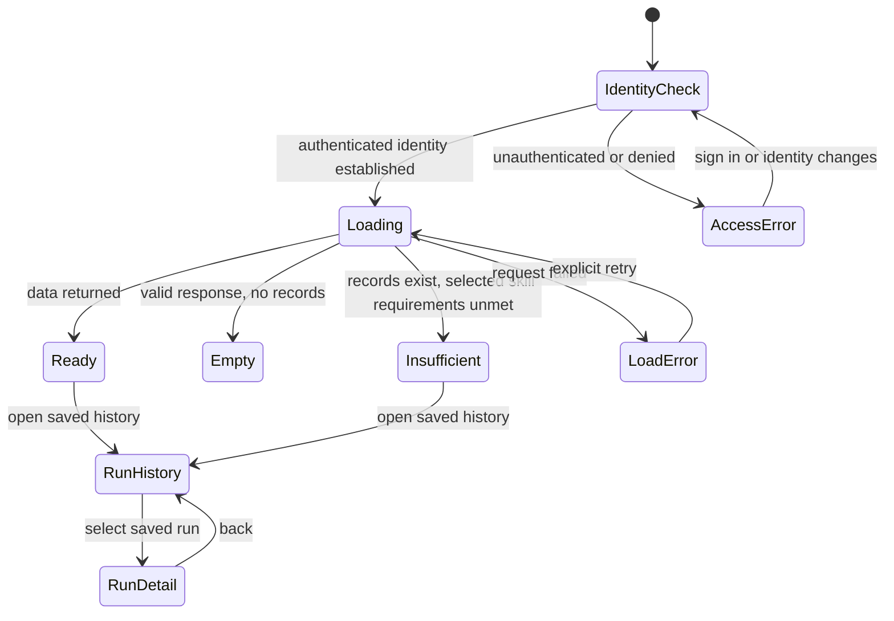

# DATARA P0 dashboard interaction contract (proposal)

**Status:** design proposal only; D04 is open and unapproved. Nothing here establishes approved product behavior.
**Work:** WP05 / shared control #8 / GitHub task #5.
**Scope:** CUS09; SR18, SR19, SR31. Related boundary: CUS10/SR20/SR21 authorization and TC14. Planned validation: TC12, TC13, TC14, TC20.
**Dependency:** the current proposed D04 in [WP01 requirements package](../management/wp01-requirements-package.md). The options there remain unresolved.

This contract describes a simple, evidence-aware dashboard for supported P0 data. It is a proposal for founder review, not an implementation specification authorized for delivery. It carries forward the proposal's readiness/training-history scope while identifying the choices that need D04. Prior-project UI incidents and results are not DATARA requirements or evidence.

## Proposed experience and boundaries

The dashboard presents the user's imported activity history, deterministic data readiness, eligible/ineligible baseline skills, and saved analysis runs. A user can inspect a saved run and its evidence, limitations, selected scope, skill version, and model identifier without invoking any model. Analysis execution, upload, supported model connections, skill choices, and run lifecycle are governed by their respective approved contracts; this document does not add capabilities to them.

Keep content classes visibly distinct:

| Class | Dashboard treatment | Example |
| --- | --- | --- |
| Observed data | Label as recorded/imported and link to source activity or source reference. | Recorded activity start, sport, duration. |
| Computed metric | Label as calculated; show unit, scope, method/version where available, and input references. | Weekly recorded duration total. |
| Assessment | Label as model-generated assessment; show saved run, skill version, selected model, evidence references, and limitations. | A saved descriptive trend assessment. |
| Failure or limitation | State that no successful assessment is available, identify a safe actionable cause where known, and preserve any previous successful run separately. | Timeout; insufficient history for a selected skill. |

Do not present recommendations in P0. Do not infer missing observations, turn an assessment into observed fact, or present failed/invalid output as a successful assessment. Unsupported demand is explained through deterministic eligibility reasons before execution. A saved failure remains inspectable in history.

## Proposed navigation and flow

1. **Enter dashboard:** resolve authenticated identity and load only that identity's summary/history. Until identity is established, show no cached user data.
2. **Review readiness:** choose an available period/scope using the approved scope controls. Show coverage, accepted/rejected/conflicting data indicators and quality warnings from the same versioned output contract as the API. No model call occurs.
3. **Choose eligible analysis:** show eligible skills as selectable and ineligible skills as unavailable with exact unmet inputs/coverage reasons. Make the selected scope and eligibility result visible before any run action. Any skill/model execution confirmation belongs to the run flow and explicit user choice; no fallback is implied.
4. **Inspect run history:** order and pagination follow the approved API contract. Opening a run displays its persisted state and data only; it does not retry, regenerate, or call a model.
5. **Inspect result:** show the saved finding classifications, evidence links/references, limitation list, snapshot/scope and skill/model versions. If evidence is unavailable or a reference cannot resolve, show that limitation; never manufacture evidence.

The chart is a proposed page-state model, not a committed route map or API design. A selected date range with insufficient data is distinct from a successful analysis whose model response failed. Use the run's persisted outcome for the latter.

## State and content contract

| State | Observable presentation and action | Data/model behavior | Trace |
| --- | --- | --- | --- |
| Initial/loading | Page title and named loading status; retain stable layout; skeletons are decorative and hidden from assistive technology. Prevent stale data from appearing under a new identity. | Read-only request; no analysis/model call. | SR18, SR20/SR21; TC12/14 |
| Empty account/history | Explain that no supported records or saved runs are available; identify the next supported action (upload or run) only if the relevant flow exists. | Empty successful response, not error. | CUS01/02/08/09; TC12 |
| Empty selected scope | Say that no accepted activities fall in this range; allow changing scope. Do not show zero as a computed performance metric unless the contract defines it as such. | Read-only; no model call. | SR18/SR31; TC12/20 |
| Ready | Show accepted data coverage, selected scope, available deterministic metrics and skill eligibility. Provide clear links to activity and run detail. | Metrics from deterministic output; saved assessment only from persisted result. | SR10/11/18/31; TC12/20 |
| Insufficient data | Name each unmet requirement (for example, required field or coverage); distinguish unavailable analysis from a failed run. Do not offer a run action for ineligible skill. | Eligibility computed deterministically before any model invocation. | SR10/11; TC20 |
| Partial quality | Show usable records separately from excluded/rejected/conflicted counts and warnings. Explain that reported values use included records and expose the affected scope. | Preserve quality metadata and source references. | SR01/04/16/18; TC12/20 |
| Run pending/running | Show persisted run state and selected scope/skill/model where available; announce state changes accessibly. | Read persisted status; viewing does not start/restart a run. | SR14/18; TC12/20 |
| Run succeeded | Show assessment classification and findings with resolvable evidence, limitation, snapshot, skill version and model identifier. | Read immutable saved result. | SR16–18/29/31; TC11/12/20 |
| Run failed/invalid | Mark as failed or invalid; show safe failure category and available next action. Keep any earlier success as a separate history item. Never render failure text as a finding. | Read saved failure status; no implicit retry or model call. | SR14/15/18/30/31; TC10/12/20 |
| Request/network/server error | State which section failed and offer explicit retry; preserve unaffected sections only when identity and response scope are known. Do not replace errors with empty-state copy. | Retry is a read request only. | SR18/31; TC12/20 |
| Permission/identity error | Generic unavailable/denied message that does not confirm another user's resource; offer sign-in or return action. Clear user-specific cached content on identity change. | Denied requests do not expose resource details. Cancel/discard late responses for prior identity. | SR20/21/31; TC14/20 |

## Accessibility and responsive behavior proposal

- All routes and controls are keyboard operable with visible focus, logical focus order, a skip link to main content, and no keyboard trap. State changes preserve or deliberately move focus; opening/closing details returns focus to the invoking control.
- Use semantic headings, landmarks, buttons, links, labels, and table headers. Do not communicate eligibility, failures, or data-quality state by color alone. Charts, if D04 retains them, have a text summary and an equivalent data table.
- Provide accessible names for icon-only controls and status text for loading, success, empty, insufficient, failure, and permission states. Announce asynchronous completion/errors through a polite live region without repeatedly announcing changing decorative content.
- At narrow widths, preserve the same data and actions; tables may scroll within a labelled region or reflow with field/value labels. No horizontal page overflow at 320 CSS px, and focus remains visible when content scrolls.
- Support browser zoom to 200% without clipped content or lost controls. Respect reduced-motion preferences; motion is not required to communicate status.
- Evidence navigation has descriptive link names and retains the run/finding context when opened. If evidence cannot be displayed, give an explicit unavailable reason instead of an inert link.

## Identity, consistency, and privacy

Every dashboard query is scoped to the authenticated user and authorized by the service, not only by UI filtering. Replacing identifiers in a URL or request cannot reveal another user's data. On sign-out or identity switch, clear rendered user data and user-scoped client state before loading the next identity. Ignore late responses associated with the previous identity, including errors that could overwrite the new view. These are proposed interface consequences of SR20/SR21; backend authorization remains independently required.

Dashboard values must agree with versioned API resources (SR31). Each saved result remains bound to its saved snapshot and skill version; a newer import or skill version does not silently rewrite historical findings. Failed retrieval of a result must not trigger regeneration. Use only safe error fields; never render credentials or raw unsafe provider payloads.

## Concrete acceptance checks (planned; no evidence yet)

These checks make the proposal observable. They are not executed tests and do not verify any requirement.

| Check | Acceptance condition | Trace |
| --- | --- | --- |
| A1, saved viewing | With inference access disabled and a persisted success/failure fixture, open dashboard, history and detail. Displayed result/status and evidence references match storage/API. Request logs show zero model calls and no new run. | TC12, TC20; SR18, SR31 |
| A2, evidence classes | Fixture containing observed fields, computed metric and assessment renders each with its own classification; metric shows unit/scope; each assessment finding links to resolvable evidence and limitations. Unresolvable evidence is disclosed and not fabricated. | TC11, TC12, TC20; SR16–18, SR29 |
| A3, empty vs insufficient | Empty account, empty period, and nonempty-but-ineligible dataset produce distinct copy and actions. Ineligible skill names unmet requirements, is not executable, and causes zero model calls. | TC07, TC12, TC20; SR10/11/18 |
| A4, loading and delayed response | Loading is announced; delayed responses do not expose prior identity data or replace newer identity content. Explicit retry repeats only the failed read. | TC12/14; SR18, SR20/21 |
| A5, failure distinctions | Timeout, authentication failure, invalid output, and read-service failure are visibly distinct from success and empty data. No failure appears in successful findings; prior successful runs remain separate. | TC10/12/20; SR14/15/18/30 |
| A6, permission and isolation | Two test identities attempt direct route access and substituted activity/run/evidence identifiers. Denied/undisclosable resources reveal no resource existence/detail; switch/sign-out clears old data; late prior-identity responses are ignored. | TC14, TC20; SR20/21/31 |
| A7, API agreement | Retrieve an activity, readiness payload, run summary and result via dashboard and API. User-visible values, resource IDs, schema versions and failure state agree; mutation methods are rejected per approved route contract. | TC13, TC20; SR19/31 |
| A8, keyboard and assistive tech | Complete navigation, scope change, history selection, detail/evidence navigation and error recovery using keyboard only. Verify labels, headings, status announcements, visible focus, focus return, and non-color status cues with a screen reader. | TC12; SR18 (proposed accessibility elaboration) |
| A9, responsive/zoom | At 320 CSS px and desktop viewport, and at 200% zoom, all content/actions remain available without page-level horizontal overflow, clipped status or hidden focus. Chart information remains available as text/table. | TC12; SR18 (proposed accessibility elaboration) |

For rendered acceptance, record the actual candidate/build identity, browser, viewport, screen-reader/keyboard method, test identity/fixture references, model-call observation, outcomes and defects. API tests alone cannot satisfy A1, A8 or A9. No such runtime or user evidence exists for this proposal.

## Open decisions and alternatives for D04

This proposal does not choose D04. The current WP01 alternatives are: **A**, approve the training-volume/readiness outcome and proposed endpoint family; **B**, reduce P0 to activity summary/readiness; or **C**, choose another athlete decision and repeat impact analysis before WP05. The following details remain open under D04 and, where noted, D03 or source/API contracts:

| Question | Alternatives / consequence | Required decision |
| --- | --- | --- |
| Primary dashboard outcome | Training-volume/readiness with descriptive history (WP01 option A); reduced activity summary/readiness (B); another decision (C). Changing outcome affects screens, metrics, skills, API and tests. | Founder resolves D04. |
| Scope selector | UTC date interval, selected activities, or both. WP01 input envelope proposes UTC interval plus activity IDs, but product controls are not approved. | Resolve alongside D02 skills and D04. |
| Readiness definition | Show proposed deterministic coverage/quality and eligible skills, or narrower summary. The precise fields and thresholds depend on approved ingestion and skill contracts. | D01/D02/D04. |
| API surface and error/pagination | WP01 lists activity, readiness, run-history and result GET resources and proposed status codes; cursor format, page limits, error details and compatibility rules remain undecided. | D04, with SR19/SR31 contract review. |
| Evidence representation/access | Inline excerpts, stable references, or authorized detail links; original files are not exposed by default in WP01. Availability, retention and source privacy need definition. | D04 and data/security review. |
| Authorization mechanism and identity transition | Session/token mechanics and cache lifecycle are unspecified. Any chosen implementation must satisfy SR20/SR21 and TC14. | D03/D04 architecture and security review. |
| Charts and visual density | Summary cards plus table, or chart with equivalent table. No visualization is mandatory unless D04 approves it. | UI detail after outcome approval. |
| Accessibility baseline | This proposal sets observable keyboard/screen-reader/responsive checks; a formal conformance target is not specified in current CUS/SR. | Founder/architect decide whether to extend SR18 baseline. |

## Traceability and evidence status

| Source | Use in this proposal | Status |
| --- | --- | --- |
| [CUS09](../management/product-requirements.md#customer-user-stories-cus) | User outcome: saved results in dashboard/API. | Proposed requirement baseline. |
| [SR18/SR19/SR31](../management/system-requirements.md#system-requirements-engineering) | Dashboard no-call viewing, API read-only/versioned, same-contract saved values. | Derived P0 requirements; dashboard details depend on D04. |
| [D04](../management/decision-register.md#open-decisions-and-change-management) and [WP01 section 5](../management/wp01-requirements-package.md#5-proposed-dashboard-outcome-and-read-only-api-v1) | Outcome, resource family, evidence, pagination and authorization alternatives. | Open; no approval inferred. |
| [TC12/TC13/TC14/TC20](../management/validation-plan.md#verification-cases) | Saved viewing with inference disabled; API consistency/mutation rejection; two-user isolation; contract conformance. | Planned; not run. |
| [Workflow and shared lessons](../team/workflow.md#design-defect-and-quality-flow), [UI Designer knowledge](../team/knowledge/ui_designer.md#ui-designer-knowledge) | Rendered UI acceptance and identity/delay coverage when a runnable product exists. | Process guidance only; prior-project evidence is not DATARA evidence. |

**Evidence status:** documentation proposal only. No application code, product test, rendered browser check, API check, model integration, system verification, athlete validation, or founder acceptance was performed or claimed. D04 and accessibility conformance target remain unresolved.
