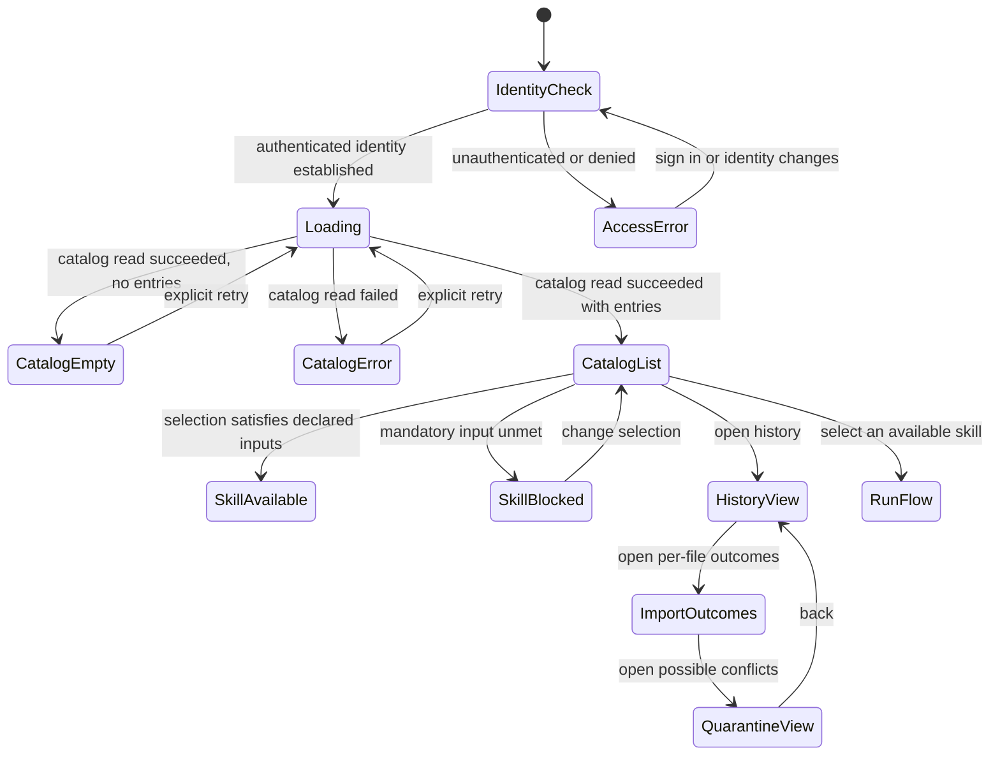

# DATARA P0 dashboard and skill-catalog front-end specification (proposal)

**Document type:** UI design specification and requirements note. Not an approved
product interface, not an accessibility conformance claim, and not evidence of any
built behaviour.

**Status:** proposal. **Nothing described in this document exists as running
software.** DATARA contains no product application source, no front-end, no template,
no stylesheet and no product test. Every screen, control, field and message below is a
*specification for a future build*, and every one of them is bound to a task that has
not been implemented.

**Assignment:** TK35 / STK110, priority P0, work package WP03, registry owner
UI Designer — Wu Yunzhou. CUS04, CUS05; FEAT31; SR11, SR58. Feeds TK34 and TK44
(System Architect / Worker), which own the machine-side eligibility contract and
implementation respectively.

**Lineage of this file:** originally authored for WP05 / shared control GitHub task
#5 under scope CUS09 and SR18, SR19, SR31, as the WP01-era D04 proposal. TK35/STK110
adds WP03 scope (CUS04, CUS05, FEAT31, SR11, SR58) to the same file rather than
creating a parallel document, so that the athlete-facing surfaces are specified in
one place. Both scopes are live; neither is retired.

**Supersedes:** the earlier WP01-era proposal in this file, which described D04 as
open. [The dated decision baseline](../management/p0-decision-baseline-2026-10-01.md)
selected D04 on 1 October 2026. The historical proposal's substance is preserved
below and in the change log at the end; only its framing is corrected. The earlier
"open D04" question rows are retained and marked resolved, not deleted.

---

## 1. The constraint this document is written under

The founder adopted a [feature-illusion rule](../project-brief-and-roadmap.md#purpose-and-final-goal),
maintained at [the project wiki](https://github.com/fengguode/DATARA/wiki/Feature-Illusion-Rule)
as its source of truth for wording. In substance: do not present anything as a
capability until it is implemented and verified, and judge wording by what a
reasonable reader would conclude rather than by what the words literally say.

That rule is usually applied to marketing copy. It binds UI design harder than it
binds prose, for three reasons that are specific to this file.

1. **A designed screen is already an implied capability.** A layout, a label and a
   flow diagram in a product design document are read by later agents, by
   implementers and by reviewers as an account of the product. If this document shows
   a skill catalog with an eligibility column, a later reader can reasonably conclude
   that a skill catalog exists. It does not. Therefore every element below is marked
   with the task that must deliver it and with the fact that it is unbuilt.
2. **Mock-ups are the specific trap.** A rendered mock of this catalog, with realistic
   fitness data, would be indistinguishable to a visitor from a real screenshot. No
   mock, placeholder, sample output, wireframe render or screenshot of any surface in
   this document may be produced, committed, shown to a customer or used in a
   landing page. Written state tables and a page-state model are the only
   representations this document may use.
3. **The temptation this design must resist is reassurance.** An eligibility panel
   is, by nature, a panel that tells a user what is wrong with their data. The
   easy way to write it is to make it sound capable — "DATARA checks your data and
   explains what it found". That sentence implies a data-inspection capability and
   an analysis act. The correct writing is impersonal and mechanical: "These inputs
   are missing", attributed to a named rule set, not to an intelligence.

### 1.1 What may exist in a customer-visible surface today

Because no application exists, the only truthful present-tense statement about any
surface in this document is that it does not exist. This applies to the dashboard,
the catalog, the import outcome list, the quarantine area and the run controls.
A customer-facing page may describe these as *designed* and *not built*, in the same
place and at the same time as any related mention, and may not show, simulate,
narrate or animate them.

---

## 2. Build-state ledger

This is the instrument that keeps the feature-illusion rule inside the design rather
than only in the status line. Every element in this document appears here. An element
with no row does not exist as a specification and must not be added to a build or a
customer-facing description without one.

| # | Element specified in this document | Delivered by | Current state |
| --- | --- | --- | --- |
| E01 | Per-file import outcome list: accepted / not imported / already had this file / needs your decision | TK11, TK15 | **Not built.** TK11 `Planned` / Blocked on decision; TK15 `Planned` / Blocked on decision |
| E02 | Whole-file rejection with a stable reason naming the missing or invalid required input | TK11 (reason), TK18 (field determination) | **Not built** |
| E03 | Quarantined possible-conflict area, visibly outside normal history | TK15, TK14 (policy) | **Not built**; resolution mechanics still open in [duplicate-conflict-options](../management/source-evidence/duplicate-conflict-options.md) |
| E04 | Explicit conflict-resolution choices (keep existing / replace with lineage / keep both) | TK15, TK14 | **Not built**; the choice set is *selected* in D01, the mechanics are not |
| E05 | Normalized activity history list with source reference, sport, UTC start, elapsed duration | TK15, TK18 | **Not built** |
| E06 | Recorded-elapsed-duration value, labelled as elapsed | TK18 | **Not built** |
| E07 | Timer-duration value, labelled distinctly and separate from E06 | TK18 | **Not built** |
| E08 | Optional-value availability notes, including GPS absence for indoor activity | TK18, TK10 | **Not built**; the field contract that decides which optional absences are noteworthy does not exist |
| E09 | Skill catalog list with declared inputs and version | TK31, TK30 | **Not built** (contract tasks only; no skill definition exists) |
| E10 | Eligibility result per skill: available / not available, with reasons | TK44, TK34 | **Not built** |
| E11 | Unmet-requirement explanation in athlete language | TK44, TK35 (this document) | **Not built** |
| E12 | Rule-set version shown with the eligibility result | TK44, TK34 | **Not built** |
| E13 | Run control, present and usable only for an available skill | TK50, TK51 (run lifecycle, not in this ledger) | **Not built**, and gated on G0 which explicitly still gates skill execution |
| E14 | Sport subsport / indoor-outdoor label | TK10 | **Not built.** The allowed sport/subsport matrix is unresolved, so this label is specified as **withheld**, not as a blank |

**Authorization dependency for every element:** TK11 and TK15 wait on TK67
(authorization before protected intake and persistence), per the
[implementation plan](../management/p0-implementation-plan.md). No surface in this
document may read or display protected user data before TK67 exists.

---

## 3. Vocabulary the athlete sees, and vocabulary they must not see

The distinction between these two tables is a design obligation, not a style
preference. The right-hand column produces a false belief even when no sentence
contains a false statement.

| Permitted in the interface | Forbidden in the interface | Why the right column is forbidden |
| --- | --- | --- |
| "Not available for this selection" | "Analysis unavailable" | "Analysis" names the run, not the check that blocked it |
| "This skill needs …" | "The model could not …" | No model is involved at this point, in either direction |
| "Checked against data rules version X" | "Checked by DATARA AI" | Implies a model was consulted |
| "Missing input: recorded elapsed duration" | "Insufficient data quality" | Names no input, so names nothing actionable |
| "3 uploads need your decision" | "3 duplicates found" | The selection is an exact-tuple heuristic, not duplicate detection (§6) |
| "This file was not imported" | "Upload failed" | "Failed" implies a system fault; most rejections are the designed outcome |
| "No GPS recorded in this file" | "GPS data missing" / "GPS error" | Reads as a defect; absent GPS is valid for indoor activity |
| "Recorded elapsed duration 42 min" | "Duration 42 min" | An unlabelled duration is ambiguous against timer duration |
| "Saved result from 2 October 2026" | "Your latest insight" | A "latest" pointer is a mutable claim about a product that does not exist |
| "Result not available — the run did not complete" | "No result" | Collapses a recorded failure into absence |

Two prohibitions apply to the whole surface and have no exception.

- **No quality score, rating, percentage, grade, star, badge, "confidence" or
  "match".** Any of these is a number the athlete would read as a judgment about
  their training, and no deterministic eligibility function produces one.
- **No suggestion, recommendation or "you might also" text.** Recommendations are
  P1 scope and are excluded from the deterministic layer in
  [implementation-contracts](implementation-contracts.md) §Cross-cutting rules 3.

---

## 4. The eligibility explanation surface

### 4.1 The rule this surface exists to make visible

Eligibility is a **pure deterministic function** of the selected snapshot, the
selected skill version and a named rule version. It makes **no model call**, of any
provider, of any kind, and it does not depend on whether a provider connection
exists, is valid, is reachable, or is configured at all.

The interface must make that true rather than merely assert it:

- The eligibility result is rendered from the deterministic result record alone. The
  read path that produces it has no provider dependency, and this is a checkable
  property, not a design intention (A4 below).
- No loading, progress or "thinking" treatment may appear in the eligibility path. A
  spinner implies waiting on something that reasons. The expected rendering is
  immediate, because the computation is immediate.
- No model, provider, connection or credential state may appear in the eligibility
  panel — not as context, not as a disabled control, not as a footnote. A run control
  rendered in a disabled state inside this panel is acceptable; a provider name is
  not, because it links the reader's mental model of *why* the skill is unavailable to
  the provider.
- If a provider connection is broken or absent, the eligibility result does not
  change and the panel does not change. This is the strongest available test that the
  panel is not model-dependent, and it is specified as acceptance check A4.

### 4.2 The four required normalized inputs

D01 requires four normalized activity inputs. A missing or invalid **required** input
rejects the **whole file**; it does not degrade the activity and it does not produce a
partially usable record. Optional values are a separate matter (§4.5).

| # | Required input | Athlete-facing name | Presentation when absent or invalid |
| --- | --- | --- | --- |
| R1 | Source reference / digest | *(not shown as a field; shown as provenance on the activity)* | Not applicable. The digest is created by the import, so it cannot be the thing that is missing. It is the trace handle the athlete is given when asking where a number came from. |
| R2 | Sport | "Sport" | The **file is not imported**. E02 shows a stable rejection reason naming sport. No sport is inferred from the file name, the folder, the device, or the previous file. |
| R3 | Session UTC start instant | "Start (UTC)" | The **file is not imported**. E02 names the missing or invalid start instant. The interface never offers a date picker as a repair, because supplying a start instant by hand would be imputation. |
| R4 | Valid recorded elapsed duration | "Recorded elapsed duration" | The **file is not imported**. E02 names the missing or invalid duration. |

Across all four, three prohibitions are absolute.

- **No imputed value.** The interface must not offer, suggest, accept or display a
  substituted start instant, sport, or duration.
- **No silent gap.** There is no rendering in which a required input is merely absent
  from the record. A file with an unmet required input produces a rejection row, and
  the row is visible until the athlete dismisses it.
- **No partial acceptance.** A file contributes no accepted activity, so it does not
  appear in history, in any weekly total, or as evidence for any value.

### 4.3 Rejection and ineligibility are different things and must not share a surface

An athlete who has uploaded a bad file and an athlete whose data cannot yet support a
skill have different problems and different remedies. Conflating them produces copy
that is wrong for one of them.

| | Rejected file (E02) | Ineligible skill (E10, E11) |
| --- | --- | --- |
| What is wrong | One uploaded file | The selection, against the current snapshot |
| Whose data is at issue | That file only | The whole selected range |
| Remedy | Re-export or correct the source file from the device; DATARA cannot repair it | Change the selected range, add more uploads, or accept that this skill does not apply |
| Does the file appear in history | No | Unrelated — other files are unaffected |
| Vocabulary | "Not imported", plus the named reason | "Not available for this selection", plus each named unmet requirement |
| Model involved | None | None |

A rejection reason must satisfy TC44: it names **its required input and the observed
gap** — for example "the session start time in this file is not a valid date and time"
— not a category such as "invalid file" and not a stack trace or decoder message.
Decoder text is not a public diagnostic contract.

### 4.4 Unmet-requirement presentation

The machine-side reason identifiers are **TK34's to freeze**, not this document's to
invent. This document therefore specifies only the *shape* of the presentation and
the rendering rules.

- **One requirement, one block.** Each unmet mandatory requirement renders as its own
  block. A summary line such as "3 of your activities are missing a start time" may
  accompany it, but the per-requirement blocks are the content.
- **Each block states four things:** which input is required, which one it belongs to
  (the activity, the file, or the selected range), what the gap is, and what the
  athlete can do. The action is mandatory; "what the athlete can do" is the part that
  turns a diagnostic into a usable screen.
- **No paraphrase loss.** The rendered text must be the approved athlete-facing string
  for the frozen reason identifier, or a rendering of it that names the same input and
  the same gap. The interface must not collapse several reason identifiers into one
  vaguer sentence.
- **Reason identifiers are visible to support, not to the athlete.** The stable
  identifier may be shown as a small reference code, because it is what makes a
  report actionable. It is never the only text.
- **The rule version (E12) is shown once, at the top of the explanation**, as
  "Checked against data rules version `<rule_version>`". This is the visible
  counterpart of the determinism guarantee: the reader can tell *which* rule set
  produced the answer, and a later change to that version will be visible as a change
  rather than as a silent reclassification.
- **A change of rule version is not a change of the athlete's data.** If a later rule
  version produces a different result for the same selection, the interface must not
  present that as a correction, an improvement, or a new finding.

### 4.5 Optional values, and absent GPS

D01 states that absent or invalid **optional** values become null with a quality
warning under the field contract, with no imputation, and that **missing GPS is valid
for indoor activities**. The field contract that decides which optional absences are
noteworthy does not exist yet, so this section specifies the presentation rule and
leaves the selection of noteworthy absences open.

- Optional absence renders in a **neutral "not available"** treatment, structurally
  distinct from both the rejection channel (§4.3) and the unmet-requirement channel
  (§4.4). It is not an error, not a defect and not a blocked skill.
- **No GPS is a supported state.** The interface states that this file contains no
  GPS record and does not label the absence as missing, lost, unavailable or
  erroneous. A status icon, colour or badge that reads as a problem is a defect.
- **The converse also holds: no GPS does not prove indoor.** The indoor/outdoor
  classification must come from the sport/subsport mapping, and that mapping is
  unresolved (E14). Until TK10 freezes it, the interface shows **no** indoor/outdoor
  label at all. A withheld label is correct; an inferred one is a data claim the
  system cannot support.
- If a skill's own declared required input is an optional activity field, then the
  **skill** is unavailable and the explanation says *"<skill> needs a recorded
  distance; your selected activities do not include one"*. The reason belongs to the
  skill's requirement, not to the file's optional absence. The two are never merged
  into a single "data quality" complaint.

### 4.6 Elapsed duration and timer duration

`total_elapsed_time` and `total_timer_time` are different measurements with different
meanings, and the selected D01 direction forbids silently switching between them. The
interface therefore treats label choice as a correctness requirement.

| Rule | Requirement |
| --- | --- |
| L1 | The P0 volume value is **recorded elapsed duration**, and every total, chart axis, table column and summary that uses it says "recorded elapsed duration" or a short form defined once and used consistently. |
| L2 | Timer duration is labelled **"Timer duration"**, in its own labelled field or column, never inside a value labelled as elapsed. |
| L3 | The bare word **"duration"** is not an acceptable label for either value anywhere in the interface. It is the ambiguity the rule exists to prevent. |
| L4 | Timer duration never appears in a weekly recorded-volume total, a trend comparison, or any figure whose label contains "elapsed". |
| L5 | There is **no fallback path**. Elapsed duration is required, so a file without it is rejected (§4.2, R4). The interface must contain no state in which a missing elapsed duration causes a timer value to be displayed as the duration. |
| L6 | When timer duration is absent from the file, that is an optional absence rendered per §4.5, and it does not alter the elapsed value or its label. |
| L7 | Any comparison between the two values presents them side by side with both labels, and states their difference as a fact about the file. It must not present one as a correction of the other. |

---

## 5. Catalog states

TK35's acceptance criteria require eligible, ineligible, empty and error cases, each
with a user-visible state, the eligibility or missing-input reason, and the available
action. That is the shape of the four rows below. Each row is a specification; none
has been built (E09, E10, E11).

| State | User-visible state | Reason shown | Available action | Operability and text |
| --- | --- | --- | --- | --- |
| **S1 Available** | The skill appears in the catalog with its declared inputs and version, and is selectable. | "Available for your selection." The skill's declared inputs are listed, and the athlete can see which of them the current selection satisfies. | Select the skill, then continue to the run flow. | Selection is a real focusable control with an accessible name, a programmatic selected/checked state, and a text equivalent. Not colour. |
| **S2 Not available** | The skill remains visible and named, and is shown as not selectable. **It is not hidden and not removed from the list.** | Every unmet mandatory requirement as its own block per §4.4, with the action for each. | No run action. The only available actions are the ones each requirement names — change the selected range, add uploads, or accept that this skill does not apply. There is no "retry" and no "try anyway". | The entry is focusable so that it can be read by keyboard and screen reader, and its reasons are reachable by keyboard. It is not a disabled button with no accessible description, because a disabled control is frequently skipped by assistive technology and would hide the explanation from exactly the users who need it. |
| **S3 Empty** | The catalog has no skill entries to show. | The reason the list is empty, distinguished by cause: no skills are declared yet, versus the catalog could not be read. | Whatever read-only action actually exists. **No action may be offered for something that does not exist.** | Announced as a status, not as an error. |
| **S4 Error** | The catalog could not be read. | A safe failure category, and what is affected. | An explicit retry of the read. Retry repeats the read and nothing else. | Distinct from S3. An empty list and a failed read must never render the same text, because they demand different responses. |

Two rules bind across all four states.

- **A skill that is not available is still named.** Removing it from the catalog
  would make the athlete conclude the skill does not exist, which is a different and
  false claim. S2 is a statement about *this selection*, not about the product.
- **S2 must be stable.** The same selection, snapshot and rule version produce the
  same S2 result on every read. A result that changes between two identical page loads
  is a defect, and TC43 exists to catch it.

---

## 6. Quarantined possible conflicts

D01 selected one specific behaviour: exact byte re-import is idempotent, and a
different-byte file whose exact `(owner, sport, UTC start, elapsed duration)` tuple
matches an existing accepted activity is **quarantined as a possible conflict**.
Normal history and skill snapshots exclude unresolved candidates. The user resolves
explicitly.

### 6.1 What the interface must and must not call this

The selected mechanism is an exact-tuple heuristic. As recorded in
[duplicate-conflict-options](../management/source-evidence/duplicate-conflict-options.md),
it can flag two genuinely different activities that happen to share a tuple, and it
misses the same activity re-exported with a different tuple. It is not duplicate
detection and it is not authoritative FIT identity.

| Rule | Requirement |
| --- | --- |
| Q1 | The interface does not use the word "duplicate" for a quarantined candidate. It says a **possible conflict** or **needs your decision**. |
| Q2 | The interface does not claim that unresolved conflicts have been found in general, or that the athlete's history is free of duplicates. Absence of a flag is absence of a flag. |
| Q3 | A quarantined candidate is **absent** from normal history, from weekly recorded-volume totals, from activity counts, and from anything that can serve as evidence for a displayed number. Absence is real, not merely a visual preference. |
| Q4 | It is **present** in a dedicated area (E03) that states how many items need a decision, so the athlete is never left with a silently incomplete history. |
| Q5 | Each entry names the existing activity it collides with and shows the tuple components that matched, so the athlete can judge whether the flag is a genuine collision. The source of both files is identified; the raw bytes are not displayed. |
| Q6 | The three resolution choices selected by D01 — keep existing, replace through an auditable supersession, keep both — are the only resolutions offered. No merge, no overwrite, no tolerance. |
| Q7 | The heuristic's limits (Q2) are stated in the area itself, not only in a design document. A user told "possible conflict" and not told what possible means will read it as certainty. |

### 6.2 What is not yet specified

Q6 names the choice set; it does not specify the interaction. The resolution
mechanics, lineage visibility, atomicity, interrupted-resolution behaviour and
post-resolution re-import semantics are recorded as open in
[duplicate-conflict-options](../management/source-evidence/duplicate-conflict-options.md)
and are owned by TK14 and TK15. This document specifies the *states* — unresolved,
and the three resolved outcomes — and does not specify the transaction that moves
between them. An implementer must not invent that transaction.

---

## 7. Content classes

Preserved from the earlier proposal and unchanged in substance. The class is part of
the visual treatment, not decoration: an athlete must be able to tell an observed
value from a calculated one from a failure without reading a caption.

| Class | Treatment | Example |
| --- | --- | --- |
| Observed data | Labelled as recorded/imported, linked to its source activity. | Recorded start (UTC), sport, recorded elapsed duration |
| Computed metric | Labelled as calculated; shows unit, scope and method version where available, with input references. | Weekly recorded elapsed duration total |
| Eligibility result | Labelled as a rule check; shows the rule version and each unmet requirement. | Not available for this selection, with reasons |
| Assessment | Labelled as model-generated; shows saved run, skill version, selected model, evidence references and limitations. | A saved descriptive trend assessment |
| Failure or limitation | States that no successful assessment is available, gives a safe cause where known, and keeps any earlier success separate. | Run did not complete |

The **Eligibility result** class is new relative to the earlier proposal, because the
eligibility explanation is the subject of TK35 and because it is the class most at
risk of being read as an assessment. It is placed between computed metrics and
assessments deliberately.

---

## 8. Page-state model

This is a page-state model, not a route map, an API design or a component list. Three
readings of it are deliberate and must be preserved by any later revision:

- `SkillBlocked` is a first-class state with its own content, not an error overlay.
  The athlete stays in the catalog and can read every reason.
- `CatalogEmpty` and `CatalogError` are separate, because they demand different
  responses from the athlete.
- There is no path from `SkillBlocked` to `RunFlow`. An unavailable skill cannot be
  run, and no interaction may create one.

---

## 9. Accessibility

The [dated decision baseline](../management/p0-decision-baseline-2026-10-01.md)
selected **WCAG 2.2 Level AA as the D04 accessibility design target**, together with
keyboard and screen-reader journeys, text/table equivalents for charts, 320 CSS-pixel
reflow, 200% zoom and reduced-motion support. That is a selected target awaiting
design and checks. **It is not a conformance claim, and this document does not assert
one.** No product, no rendered page and no assistive technology has been tested.

TK35's acceptance criteria require this document to list accessibility questions and
D02 decisions **without selecting a UI design or a standard**. Accordingly this
section specifies observable behaviour and then lists what remains open. It does not
select a visual language, a component library, a colour system or a conformance level
of its own.

### 9.1 Specified behaviour

- The catalog is operable by keyboard alone, in a logical order, with a visible focus
  indicator on every focusable element and no keyboard trap.
- **State is never conveyed by colour alone.** Available, not available, empty and
  error each carry a text equivalent. An athlete who cannot distinguish the available
  entry from the blocked one is not blocked by the interface — they are misled.
- An entry that is not available is **reachable and readable by keyboard and screen
  reader**, with its reasons. It is not a `disabled` attribute with a
  `aria-disabled` announcement and no accessible content.
- Each unmet-requirement block is a labelled region with a heading that names the
  requirement, so a screen-reader user can navigate reasons individually rather than
  hearing one undifferentiated paragraph.
- The eligibility result is a status region. Its content changes as the selection
  changes, and the change is announced politely, once, without re-announcing
  decorative content.
- Rejected-file outcomes and quarantined candidates are reachable by keyboard and are
  announced as status, distinct from each other and from eligibility reasons.
- At 320 CSS pixels and at 200% zoom, all reasons and their actions remain reachable
  with no horizontal page overflow and no clipped content.
- Motion is not used to convey or to delay any state, and reduced-motion preferences
  are respected.
- A skip link reaches the main content; a selected reason retains the context of the
  skill it belongs to when the athlete navigates to the activity it names.

### 9.2 Open questions assigned, not answered here

These are referred onward. They are not design decisions this role may take.

| # | Question | Referred to | Why it is not a design decision |
| --- | --- | --- | --- |
| A1 | Which assistive technologies and environments are in scope for the evidence, and what is recorded when a specific combination is unsupported? | Founder / Architect, via TC45 | TC45 requires unsupported assistive-technology assumptions to be recorded; choosing the supported set is a product and evidence decision |
| A2 | Does the selected WCAG 2.2 AA target extend to any surface beyond the P0 dashboard, and does it require a formal conformance statement? | Founder / Architect | D04 selected a *target*; whether to assert conformance and for which surfaces is a founder decision |
| A3 | Is the legal-applicability question for this surface in scope anywhere in P0, and who owns it? | Founder / Architect | [The requirements review](../team/reviews/p0-requirements-review.md) records that CUS05 legal unknown maps to sourced legal investigation and **not** to UI accessibility TK35 |
| A4 | Does the catalog need a visual scan-order or filter design once the skill shortlist exists? | Architect, then this role | The shortlist (TK30) does not exist, so the number of entries and their variability are unknown |

---

## 10. D02 decisions this surface depends on and does not make

| Decision | What the surface needs | Owner | State |
| --- | --- | --- | --- |
| Skill shortlist and declared inputs (E09) | Which entries exist and what each declares | TK30, TK31, D02 | Proposed / Blocked on decision. **No skill definition exists.** |
| Eligibility outcomes and stable unmet-requirement identifiers (E10, E11) | The frozen reason set the interface renders 1:1 | TK34, D02 | Blocked on decision. Not frozen. |
| Sport/subsport mapping and indoor-outdoor classification (E14) | Whether an indoor/outdoor label may be shown at all | TK10, D01 | Unresolved. Label withheld. |
| Optional-absence warning policy | Which optional absences are noteworthy enough to note | Field contract, D02/WP02 | **Does not exist.** Not authored, and not to be invented by the interface |
| Conflict policy mechanics and lineage (E03, E04) | The resolution interaction | TK14, TK15, D01 | Choice set selected; mechanics open |
| Metric method/version display | The version string shown beside a computed value | TK21, D02 | Proposed. The `Metric` schema is referenced but not authored, so any metric persisted before that contract exists is provisional |

---

## 11. Acceptance checks

**Planned. Not executed. No product, build, browser, screen reader or API check has
been performed for this specification, and none can be until the delivering tasks
exist.** These are written now so that the conditions are decidable later, and so that
their absence is explicit rather than discovered at the end.

| # | Condition when a runnable candidate exists | Trace | Delivered by |
| --- | --- | --- | --- |
| A1 | Every state in §5 renders distinct text and a distinct available action. An empty catalog and a failed catalog read are visibly different. | SR58, TC45, TC07 | E09, E10 |
| A2 | An ineligible skill is named, visible, not selectable, and shows every unmet requirement with its action. No run control is offered. **Zero model calls are observed** for the whole ineligible journey. | SR10, SR11, TC07, TC20, TC44 | E10, E11, E13 |
| A3 | Each displayed reason matches the machine unmet-requirement result exactly in the required input named and the gap named, and contains no other user's data. | SR53, TC44 | E11, TK44 |
| A4 | The eligibility panel renders identically with (a) no provider connection configured, (b) a valid connection, and (c) a broken connection. Request logs for the eligibility read show zero provider calls and zero inference requests. | SR10, SR11, TC20 | E10, E13 |
| A5 | A file missing a required input appears in the import outcome list with a stable reason naming that input and the observed gap; it does not appear in history, in any total, or as evidence; and no substituted value is displayed anywhere for it. | SR01, SR02, SR05, SR27, TC01, TC04 | E02, E05 |
| A6 | A quarantined candidate is absent from history and totals and present in the conflict area, which states the count, the colliding activity, the matched tuple components and the heuristic's limits. The word "duplicate" does not appear for it. | SR03, SR04, TC02, TC03 | E03 |
| A7 | A file with no GPS record renders a neutral "no GPS recorded in this file" note, with no error, defect, warning-emphasis or blocked-skill consequence; and no indoor/outdoor label is shown for it. | SR06, D01, TK18 | E08, E14 |
| A8 | Elapsed and timer durations are separately labelled wherever they appear; neither is labelled bare "duration"; timer duration appears in no total labelled elapsed; and there is no rendering in which a missing elapsed duration displays a timer value as the duration. | SR05, SR06, D01 | E06, E07 |
| A9 | The eligibility panel contains no model, provider, connection or credential reference, and no loading or progress treatment. | SR10, SR11, TK35 | E10, E11, E12 |
| A10 | The whole catalog is operable by keyboard; every state is distinguishable without colour; every not-available entry is reachable and its reasons are individually navigable; and the 320 CSS-pixel and 200% zoom conditions hold. The actual screen reader and environment are named in the evidence. | SR18, SR58, TC45 | E09–E12 |
| A11 | Dashboard and API return the same eligibility result, rule version and reason identifiers for the same selection. | SR19, SR31, TC13 | E10, E12 |
| A12 | Re-reading the same selection with the same snapshot and rule version produces the same result and the same reasons. | SR53, TC43 | E10, E12 |
| A13 | Nothing on any surface uses a score, rating, percentage, grade, confidence, badge, suggestion or recommendation. | SR11, SR29 | all |
| A14 | No screen, control or message in this document exists in a customer-visible surface, mock, screenshot, wireframe or narrated walkthrough while the delivering tasks are unbuilt. | [Feature-illusion rule](../project-brief-and-roadmap.md#purpose-and-final-goal) | this document |

Rendered acceptance must record the candidate commit, build identity, browser,
viewport, screen reader and method, test identity, fixture references, observed model
calls, outcomes and defects. An API test cannot satisfy A1, A9 or A10.

---

## 12. Changes required in files this role does not own

Reported, not made, per the assignment's file boundary.

| File | Required change |
| --- | --- |
| `docs/management/source-evidence/duplicate-conflict-options.md` (TK14) | Q1–Q7 assume an explicit athlete-facing presentation of the exact-tuple heuristic's limits. The interaction states in §6.2 need resolution mechanics and lineage visibility from this record before TK15 can build E03/E04. |
| `docs/management/requirements-registry.json` and the mirrored SR records | E14 depends on a resolved sport/subsport matrix (TK10). If D01 freezes indoor/outdoor classification, TK35's §4.5 label state changes from *withheld* to *specified* and this document must be refreshed. |
| `docs/management/system-requirements.md` | SR58 requires catalog states to be identifiable "through text and keyboard operation". It does not name the zero-model-call property of the eligibility surface; SR10/SR11 carry it. Confirm that TC45's evidence covers both, or record the gap. |
| `docs/management/p0-implementation-plan.md` | TK35 is a W0 contract-design task and TK44 depends on it. This document does not change any order, priority, dependency or gate, and asserts no change to them. |

---

## 13. Earlier open D04 questions and their disposition

The WP01-era version of this file closed with a table of D04 questions presented as
unresolved alternatives. That table is preserved here with its disposition after the
1 October 2026 selections, so that the reasoning that informed this specification is
not lost when the questions were closed. The middle column is the earlier text, not a
new position.

| Question (as raised in the earlier proposal) | Earlier alternatives / consequence | Disposition after 1 October 2026 |
| --- | --- | --- |
| Primary dashboard outcome | A, approve the training-volume/readiness outcome and proposed endpoint family; B, reduce P0 to activity summary/readiness; C, choose another athlete decision. | **Resolved — option A.** D04 selected recorded training volume and data readiness. The dashboard holds imported history, quality and conflicts, weekly recorded volume by sport, eligibility reasons, and saved runs, results and failures with evidence. |
| Scope selector | UTC date interval, selected activities, or both. | **Partially resolved.** D02 fixed the *time basis* — UTC instants, half-open `[start, end)`, weeks beginning Monday 00:00, a recorded activity belonging to its start date, trend over the last four complete UTC weeks inside a scope of at least 28 days, consistency over at least 28 complete UTC days. The dashboard *control* itself is not named in the baseline. Open, and it changes the control this specification must render. |
| Readiness definition | Proposed deterministic coverage/quality and eligible skills, or a narrower summary. | **Partially resolved.** D04 names the content; the exact fields and thresholds still depend on TK11, TK18, TK21, TK44 and the field contract that does not yet exist. |
| API surface and error/pagination | Listed GET resources and proposed status codes; cursor format, page limits, error details and compatibility rules undecided. | **Resolved at direction.** D04 fixed the `/api/v1` GET families, `api_version`, 401/404/403/422/429/405 semantics, defaults of 50 and a 200 maximum, and a signed owner- and filter-bound cursor with a deterministic tie-breaker. Exact JSON Schemas remain TK56/TK60/TK63 work. |
| Evidence representation/access | Inline excerpts, stable references, or authorized detail links; originals not exposed by default. | **Partially resolved.** D04 chose opaque owner-scoped identifiers, structured references with metric lineage, and originals reachable only through the authorized app's explicit original-file path — never by public or static URL and never through the output API. The exact representation format is not frozen. |
| Authorization mechanism and identity transition | Session/token mechanics and cache lifecycle unspecified. | **Resolved at direction.** D05 selected built-in app session identity for the browser pilot, with a separate owner-bound read-only API token. D03 states that provider keys never double as output-API tokens. Exact setup mechanics remain a setup-contract item. |
| Charts and visual density | Summary cards plus table, or chart with equivalent table; no visualization mandatory unless D04 approves it. | **Open.** D04 permits charts with text/table equivalents and does not require one. This remains a design detail that cannot be settled before the read surface exists. |
| Accessibility baseline | Observable keyboard/screen-reader/responsive checks proposed; a formal conformance target not specified in current CUS/SR. | **Partially resolved.** D04 selected WCAG 2.2 AA as the design target, with keyboard and screen-reader journeys, chart text/table equivalents, 320 CSS-pixel reflow, 200% zoom and reduced motion. Whether SR18 is formally extended to record that target, and whether any conformance statement will be made, remains open and is a founder/architect decision (§9.2 A2). |

The first, fourth and sixth dispositions are read directly from the dated baseline and
are **verified** against it. The rest are my reading of what that baseline does and
does not say, and are marked partial or open rather than resolved because the
baseline does not close them.

---

## 14. Traceability and evidence status

| Source | Used for | Status |
| --- | --- | --- |
| [CUS04 / CUS05](../management/product-requirements.md#customer-user-stories-cus) | Choose evaluated expertise options; understand unavailable analyses | Approved requirement text |
| [SR10, SR11, SR53](../management/system-requirements.md) | Deterministic eligibility before execution; unavailable without a model call; repeatable reasons | Approved SR text; SR53 is a draft derived requirement pending D02 |
| [SR58](../management/system-requirements.md) | Operable, non-colour-only catalog states | Draft derived requirement pending D02 |
| [TC07, TC20 in Planned cases; TC43, TC44, TC45 in Added planned verification cases](../management/validation-plan.md) | Eligibility rejection, repeatability, explanation content, accessibility states, contract conformance | **Planned. Not run. Evidence empty.** |
| [D01, D02, D04 selections](../management/p0-decision-baseline-2026-10-01.md) | Required inputs, no-imputation, conflict quarantine, dashboard outcome, accessibility target | Selected direction; conformance evidence pending; G0 not satisfied |
| [fit-support-matrix](fit-support-matrix.md) | Field identities, invalid sentinels, elapsed/timer separation, no inference from GPS absence | Evidence-backed preparation; not a conformance result |
| [duplicate-conflict-options](../management/source-evidence/duplicate-conflict-options.md) | Exact-tuple heuristic, resolution choice set, open mechanics | Proposed research output |
| [implementation-contracts](implementation-contracts.md) | Deterministic layer makes no model call; ineligible selections expose unmet rules and produce zero provider calls | Proposal |
| TK35/STK110 acceptance criteria | Eligible, ineligible, empty, error; visible state, reason, action; accessibility questions listed without selecting a design or standard | This document addresses it in §5, §9 and §10 |

**Evidence status of this document:** design specification and requirements note
only. No application code, product test, rendered browser check, API check, model
integration, system verification, athlete validation, founder acceptance or release
was performed or claimed. No task, requirement or case is marked Done, Verified,
Accepted or Released by this document. D02 skill declarations, the eligibility reason
contract and the optional-absence field contract do not exist, so several elements
above specify the *shape* of behaviour whose *content* is not yet frozen — and that
limit is stated in §10 rather than papered over with invented text.

---

## 15. Change log

| Date | Change | Basis |
| --- | --- | --- |
| 1 October 2026 | Original WP01-era proposal: proposed experience, navigation, page-state model, state/content contract, accessibility proposal, A1–A9 acceptance checks, open D04 questions, evidence status. D04 described as open. | WP01 requirements package |
| 2 October 2026 | TK35/STK110 specification added. The "D04 is open" framing is corrected against the dated baseline, which selected D04; the earlier open-question rows are retained and marked resolved rather than deleted. Added: the build-state ledger; the vocabulary tables; the eligibility explanation surface including the four required inputs, rejection-versus-ineligibility, unmet-requirement presentation, optional-absence and GPS treatment, and elapsed/timer rules; the catalog state table; the quarantine rules; the Eligibility result content class; the accessibility open-question list; the D02 dependency list; A1–A14; and the required-changes list. Sections 7, 8 and the general shape of sections 1–6 are preserved from the earlier proposal. | TK35 / STK110; D01–D04 selected baseline; [feature-illusion rule](../project-brief-and-roadmap.md#purpose-and-final-goal) |
